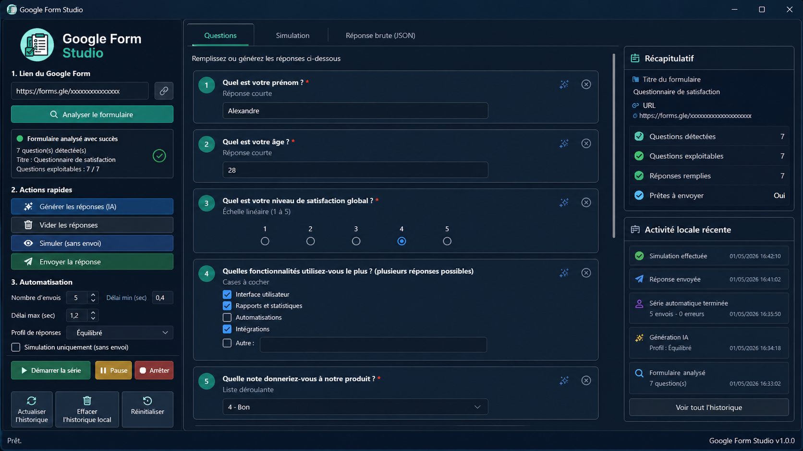

# Google Form Studio


[](https://github.com/Madrador60/Bots_Google_Forms/releases/latest/download/GoogleFormStudio.exe)

Google Form Studio est une application Windows pour analyser un Google Form public, préparer des réponses, simuler un envoi et utiliser une interface graphique simple.



## Installation Windows avec .exe

C'est l'option recommandée. Elle ne demande pas d'installer Python.

Ouvrir PowerShell, coller cette ligne, puis appuyer sur Entrée :

```powershell
irm https://raw.githubusercontent.com/Madrador60/Bots_Google_Forms/main/installer.ps1 | iex
```

Cette commande télécharge `GoogleFormStudio.exe`, installe l'application dans `%LOCALAPPDATA%\GoogleFormStudio`, ajoute la commande `googleform`, puis lance l'application automatiquement.

Lien direct :

[Télécharger GoogleFormStudio.exe](https://github.com/Madrador60/Bots_Google_Forms/releases/latest/download/GoogleFormStudio.exe)

Si Windows SmartScreen affiche un avertissement, cliquer sur `Informations complémentaires`, puis `Exécuter quand même`.

## Utiliser avec Python

Cette option est utile pour modifier le code, lancer les tests ou reconstruire l'exe.

```powershell
irm https://raw.githubusercontent.com/Madrador60/Bots_Google_Forms/main/scripts/win/install_source.ps1 | iex
```

Prérequis :

- Windows 10 ou 11
- Python 3.10 ou plus récent
- cocher `Add Python to PATH` pendant l'installation

Construire l'exe depuis le code source :

```bat
googleform build
```

## Commandes utiles

```bat
googleform           Lance l'interface graphique
googleform cli       Lance le mode terminal
googleform version   Affiche la version installée
googleform update    Met à jour l'application
googleform uninstall Désinstalle l'application
googleform test      Lance les tests
googleform build     Crée dist\GoogleFormStudio.exe
googleform help      Affiche l'aide
```

## Désinstaller

Depuis le CMD ou PowerShell :

```bat
googleform uninstall
```

Dossier supprimé pour la version `.exe` :

```text
%LOCALAPPDATA%\GoogleFormStudio
```

Dossier supprimé pour la version Python :

```text
%LOCALAPPDATA%\Bots_Google_Forms
```

## Fonctionnalités

- analyse d'un Google Form public depuis son URL;
- interface graphique Windows;
- remplissage manuel;
- génération automatique de réponses;
- profils automatiques : prudent, équilibré, varié;
- simulation sans envoi;
- envoi unitaire;
- envoi en série avec progression;
- pause, reprise et arrêt propre d'une série;
- journal récent local;
- suppression de l'historique local depuis l'interface.

## Questions prises en charge

- réponse courte;
- paragraphe;
- choix multiple;
- liste déroulante;
- cases à cocher;
- échelle linéaire;
- grille à choix unique;
- grille à cases;
- date;
- heure.

## Confidentialité

Chaque machine garde son propre historique local.

Les journaux, les derniers formulaires analysés et les dernières simulations ne sont pas envoyés sur GitHub. Ils restent uniquement sur le PC de l'utilisateur.

Le bouton `Effacer l'historique local` supprime le journal récent, le journal du lanceur Windows, le dernier formulaire analysé et la dernière simulation sauvegardée.

## Release

La Release GitHub publie automatiquement `GoogleFormStudio.exe` :

[Dernière Release](https://github.com/Madrador60/Bots_Google_Forms/releases/latest)

Changelog v1.0.0 :

- version `.exe` Windows;
- icône personnalisée;
- installation sans Python;
- commande `googleform version`;
- mise à jour et désinstallation depuis le CMD;
- historique local par machine.

## FAQ

### Windows bloque l'exe, que faire ?

Cliquer sur `Informations complémentaires`, puis `Exécuter quand même`. L'avertissement peut apparaître parce que l'exe n'est pas signé avec un certificat payant.

### Où sont les logs ?

Ils sont créés localement dans le dossier d'installation, dans `logs/`. Ils ne sont pas envoyés sur GitHub.

### Comment désinstaller ?

```bat
googleform uninstall
```

### Comment mettre à jour ?

```bat
googleform update
```

## Structure du projet

```text
Bots_Google_Forms/
├─ app/                 Code Python de l'application
├─ assets/              Icône et image README
├─ scripts/win/         Scripts Windows
├─ tests/               Tests automatiques
├─ installer.ps1        Installation version .exe
├─ googleform.bat       Commande principale
├─ requirements.txt     Dépendances Python
└─ README.md            Documentation
```

## Notes

- Le formulaire Google doit être public.
- Certains formulaires peuvent avoir une structure atypique.
- Google Forms peut modifier son fonctionnement avec le temps.
- Utiliser l'outil uniquement sur des formulaires que vous êtes autorisé à tester ou administrer.
